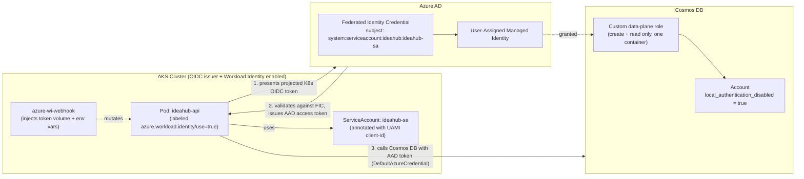

# IdeaHub - App on AKS connecting to → Cosmos DB via Workload Identity + OIDC Federation + UAMI

A minimal, working reference for the pattern Azure recommends for production:
**pods authenticate to Cosmos DB as a User-Assigned Managed Identity (UAMI)
via OIDC federation — no connection string, no key, no `Secret` object,
anywhere in the cluster.**

The app itself is intentionally trivial (save an `idea` + optional
`description`, list them back). The project is not about the app — it's
about the infra and security plumbing around it.

## Why this instead of a connection string

| | Connection string / key | Workload Identity + UAMI |
|---|---|---|
| Where it lives | K8s `Secret` (base64, not encrypted by default) or app config | Nowhere — never generated, never stored |
| Rotation | Manual, or you build automation for it | N/A — tokens are short-lived (~1hr) and auto-refreshed |
| Blast radius if leaked | Full key grants broad account access until rotated | Nothing to leak; a leaked *token* expires in ~1hr and is scoped to what RBAC allows |
| Audit trail | "Someone used the key" | Every token exchange is tied to a specific identity in Azure AD sign-in logs |
| Scope of access | Whatever the key type allows (often account-wide) | Exactly what you grant via Cosmos DB RBAC (this repo scopes it to create+read on one container) |

## Architecture Diagram

[](https://aks-workload-identity.vercel.app/)

*Click the image to interact with the live workflow.*



**The trust chain, end to end:**

1. AKS is created with an OIDC issuer (`oidc_issuer_enabled = true`) — the
   cluster now publishes a standard OIDC discovery document, making it a
   trusted token issuer, similar to any other identity provider.
2. A **federated identity credential** on the UAMI says: "trust OIDC tokens
   from *this* issuer, but only if the subject is exactly
   `system:serviceaccount:ideahub:ideahub-sa`." (`terraform/identity.tf`)
3. The Kubernetes `ServiceAccount` is annotated with the UAMI's client ID.
   The Pod is labeled `azure.workload.identity/use: "true"`. Together, these
   make AKS's `azure-wi-webhook` mount a short-lived, auto-rotated OIDC
   token into the pod and set `AZURE_CLIENT_ID` / `AZURE_TENANT_ID` /
   `AZURE_FEDERATED_TOKEN_FILE` env vars — **no code change needed**.
4. In the app, `DefaultAzureCredential()` (Azure Identity SDK) finds those
   env vars automatically, presents the token to Azure AD, and gets back a
   real access token scoped to the UAMI. This all happens inside
   `app/cosmos_client.py` — there's no manual token handling.
5. Cosmos DB has `local_authentication_disabled = true` — **keys are
   rejected at the data plane even if someone finds one** — and a custom
   RBAC role grants the UAMI only `create` + `read` + `query` on one
   container. That's the app's entire footprint of permission.

## Repo layout

```
terraform/     AKS, ACR, Cosmos DB, UAMI, federated credential, VNet, RBAC
app/           FastAPI service (main.py, models.py, cosmos_client.py)
k8s/           Namespace, ServiceAccount, ConfigMap, Deployment, Service,
               CiliumNetworkPolicy — notably, no Secret manifest
scripts/       deploy.sh (terraform + build + apply), verify.sh (smoke test)
docs/          devsecops-checklist.md — controls implemented + prod hardening
```

## Prerequisites

- Azure CLI, logged in (`az login`) with rights to create resource groups
- Terraform >= 1.7
- `kubectl`
- `envsubst` (part of `gettext` — `apt install gettext-base` / `brew install gettext`)

## Deploy

```bash
cd terraform
cp terraform.tfvars.example terraform.tfvars   # adjust if needed
cd ..
./scripts/deploy.sh
```

This runs `terraform apply`, builds the image with `az acr build` (build
happens inside Azure — no local Docker daemon or registry credentials
needed), then renders and applies the k8s manifests with values pulled
straight from `terraform output`.

## Verify

```bash
./scripts/verify.sh
```

This port-forwards the (intentionally ClusterIP-only) service, confirms
`kubectl -n ideahub get secrets` returns nothing, then exercises
`/readyz`, `POST /ideas`, and `GET /ideas`. A successful `/readyz` is the
actual proof the identity federation is wired correctly — it only returns
200 if the pod authenticated to Cosmos DB in the last few seconds.

To inspect the token exchange yourself:

```bash
kubectl -n ideahub exec deploy/ideahub-api -- env | grep AZURE_
```

## Cleanup

```bash
cd terraform && terraform destroy
```

## See also

[`docs/devsecops-checklist.md`](docs/devsecops-checklist.md) — every control
implemented here, plus what to add before this goes near real production
traffic (private endpoint, Azure Policy initiatives, Defender for Cloud,
CI image scanning).
